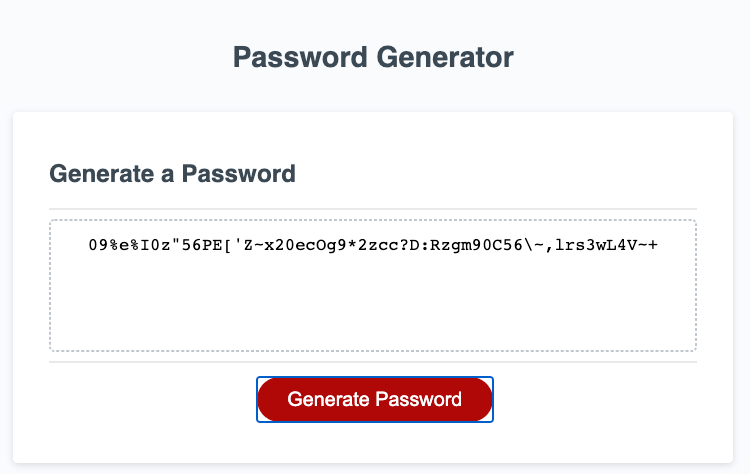

# Random Password Generator #

https://n-lambert.github.io/passwordGenerator/

## Table Of Contents ##

- [Section 1: Introduction](#introduction)
- [Section 2: Usage](#usage)
- [Section 3: Credits](#credits)
- [Section 4: License](#license)

## Introduction ##

This is a random password generator. It takes two inputs: password length and character type to generate a random string for use as a secure password. 

## Usage ##

Anyone is free to find the source code here on GitHub. You can access the files through cloning the repo. 

To run the password generator visit the URL beneath the website screenshot. The site will generate a random password based on given inputs for which you will be prompted. Password length must be an integer between 8 and 128 (inclusive) and you must choose at least one but not more than 4 character types: lowercase, uppercase, number, special character. The resulting password will include the chosen character types combined with a random selection of other character types.

## Credits ##

- JavaScript.info (for the Fisher-Yates shuffle): https://javascript.info/task/shuffle

## License ##

GNU General Public License